# COVID-19 Analysis

Group Members: Sybile Cherenfant, Megan Cogguillo, Vasudha Nai, Brandon Lee

Project description:

Our project analyzed county-level data from Johns Hopkins on COVID-19 cases and deaths, assessing the relationship between certain demographic characteristics and COVID outcomes.

In particular, we sought to understand:

  Do counties with older populations have higher case counts and/or death rates? (Brandon)
  
  Do counties with higher poverty rates have higher case counts / death rates? (Sybile)
  
  Do counties with limited health insurance coverage have higher cases counts / death rates? (Vasudha)
  
  Is there a relationship between political affiliation of each county (based on 2016 presidential election) and case counts / death rates? (Megan)

## Age (65 years old and over) - Brandon

  - Null Hypothesis: There is no relationship between the 65 and over group and COVID-19 cases and deaths.

  - Alternative Hypothesis: The 65 and over group has a correlated effect on confirmed COVID-19 cases and deaths.
  
  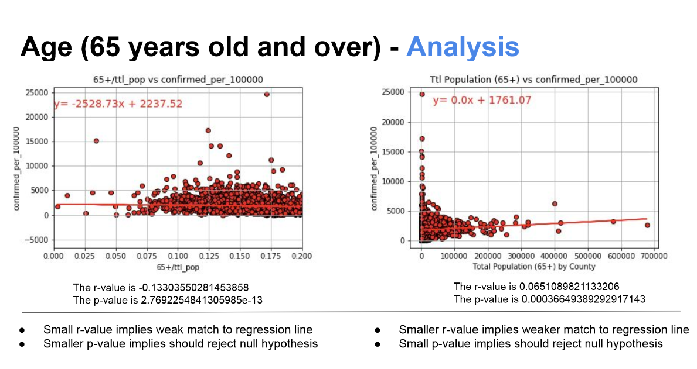

  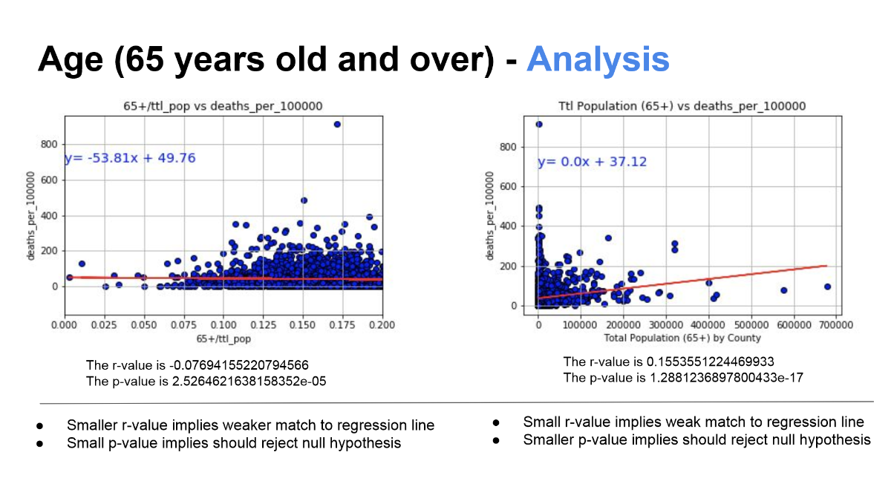

  In all cases, extremely low p-value suggests rejecting null hypothesis. therefore, we can say age has a role in cases and deaths, but based on plots, age is not a significant influence.

  In all cases, we hace well below 0.5 r-value, suggesting data does not fit regression line, illustrating there are many more factors with rising case and death rates. 

## Poverty Rates - Sybile

  - Null Hypothesis: There is no relationship between confirmed cases/death rates and poverty level.

  - Alternative Hypothesis: The higher the poverty level, the more confirmed cases and death rates in the U.S..

  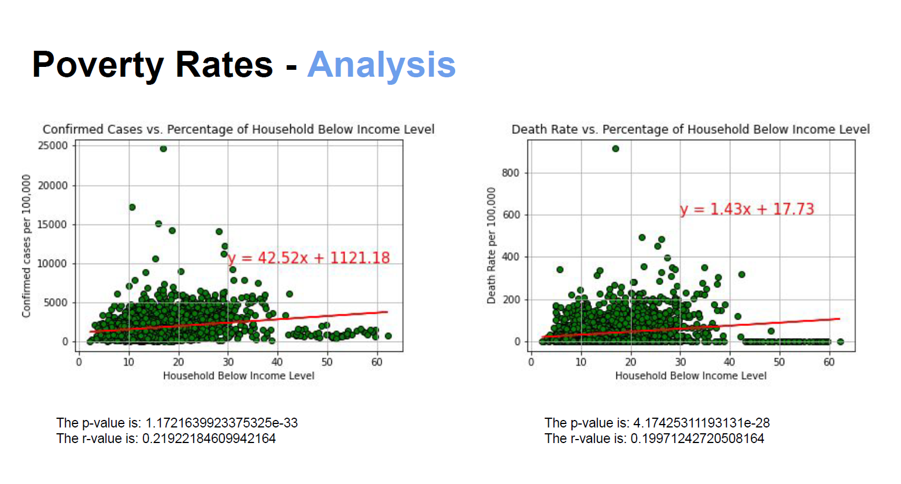

  - P-value for both charts is < 0.05, meaning there is a relationship between poverty level and rate of confirmed cases and deaths. r-value for both charts is about 0.2 (weak positive linear regression model), meaning the relationship between poverty level and rate of confirmed cases/deaths is low. To sum it up, poverty alone does not impact the rate of confirmed cases/deaths. There are other variables that play a role in them.

## Insurance Coverage - Vasudha

  - Null Hypothesis: Population with no health insurance does not affect the case counts and/or death rates.

  - Alternative Hypothesis: The more the percentage of without health insurance, the more the confirmed cases and/or death rates.

  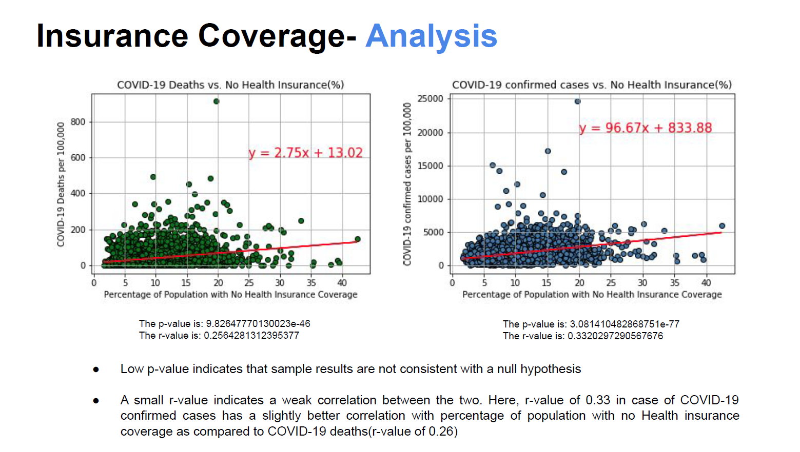

  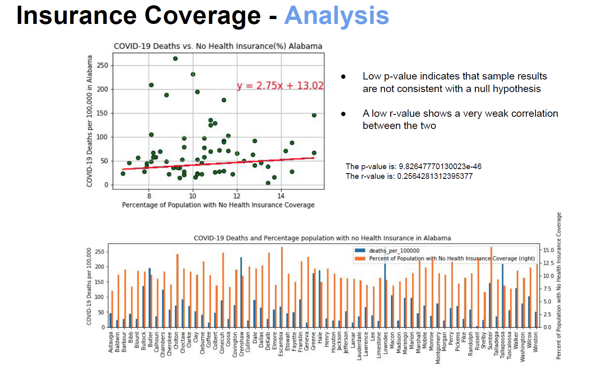

  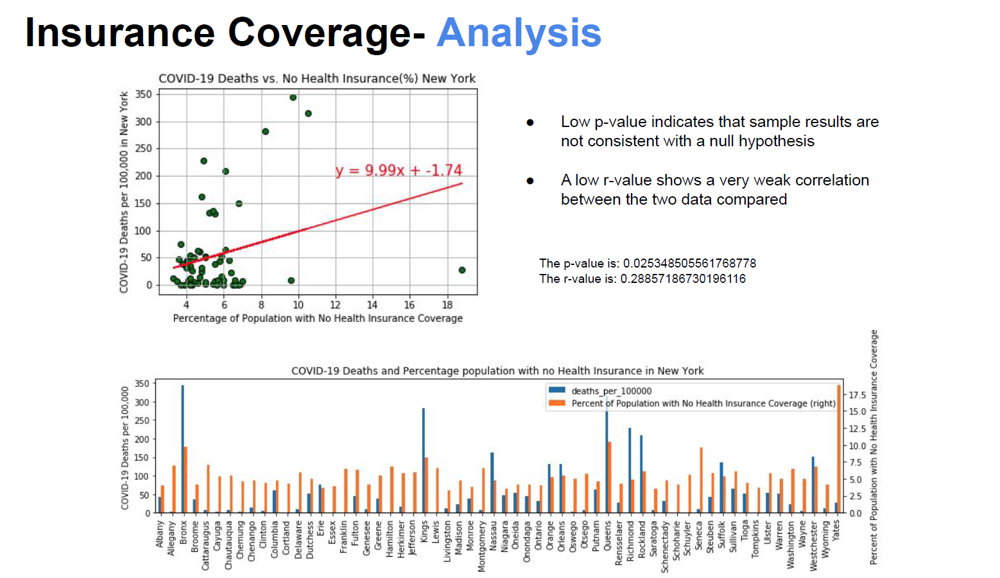

  - Conclusions from the scattter plots and linear regression models indicate that COVID-19 deaths in various counties are weakly affected by the percentage of population without health insurance. the low p-values for all the plots implies that the null hypothesis should be rejected while the low r-values suggest that there is a weak correlation between population without health insusrance and case counts and/or death rates.

## Red Counties vs. Blue Counties - Megan

  - Null Hypothesis: There is no relationship between the margin by which Trump won/lost in a county and (1) case rates and (2) death rates.

  - Alternative Hypothesis: "Redder" counties (based on margin of victory) have higher (1) case rates and (2) death rates than "bluer" counties.

  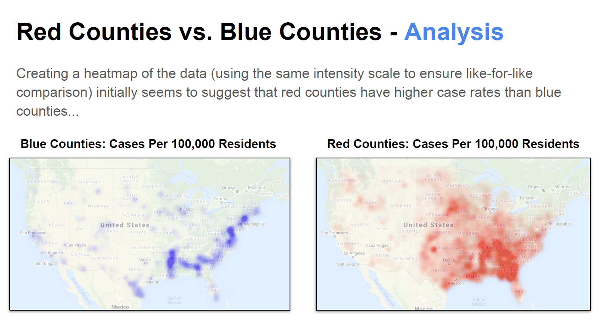

  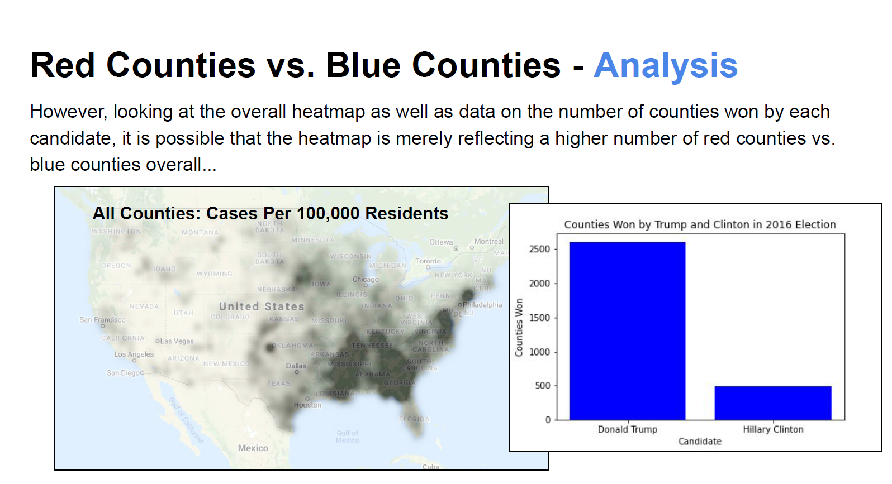

  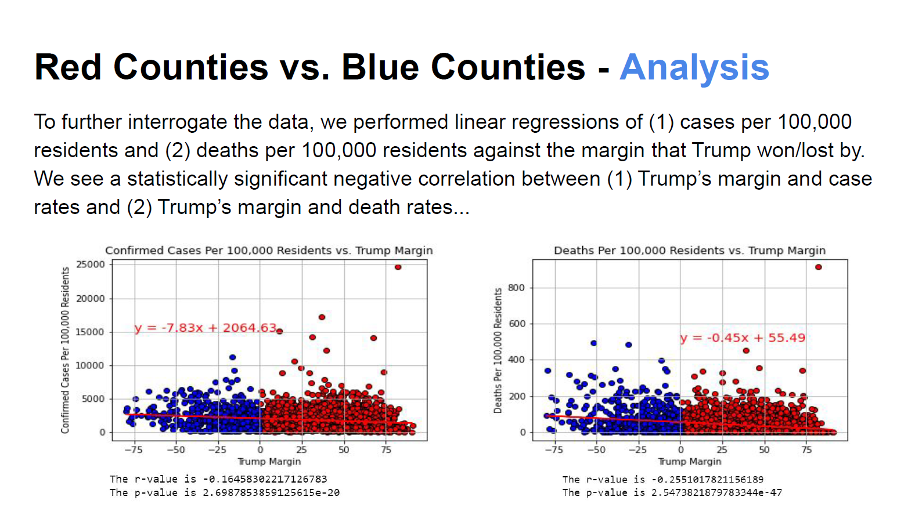

  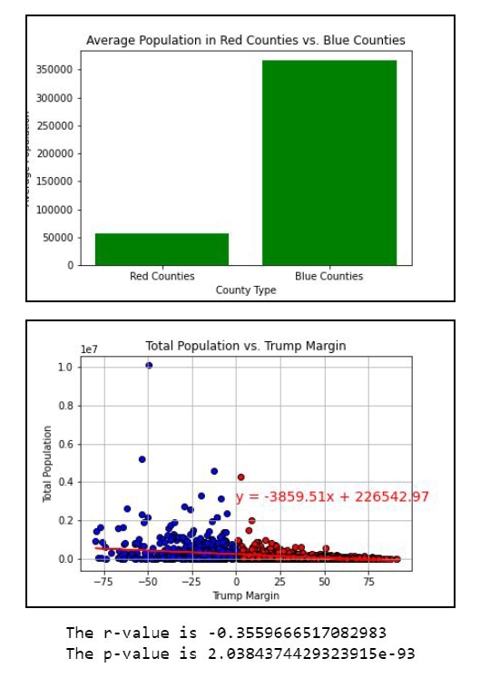

  - While redder counties fared slightly better than bluer counties, there may be other factors driving this correlation. For instance, blue counties have higher average population size, and larger cities may have higher case rates and death rates than rural areas. In addition, dataset shows cumulative cases at a point in time (data as of 9/23); news souces suggest that blue counties initially had higher case counts and death rates, but red counties had since caught up.

## Conclusion

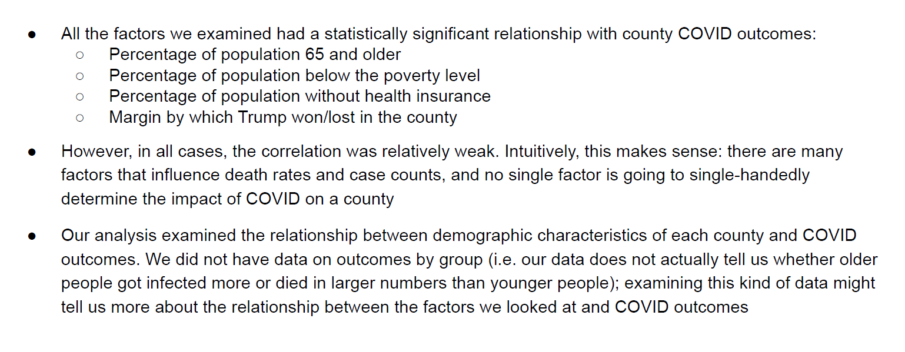
  

  
  

